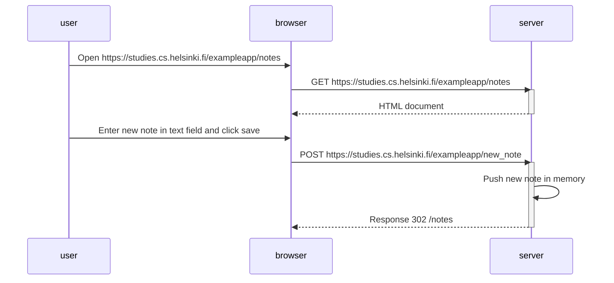

```mermaid
sequenceDiagram
participant user
participant browser
participant server

    user->>browser: Open https://studies.cs.helsinki.fi/exampleapp/notes
    browser->>server: GET https://studies.cs.helsinki.fi/exampleapp/notes
    activate server
    server-->>browser: HTML document
    deactivate server

    user->>browser: Enter new note in text field and click save
    browser->>server: POST https://studies.cs.helsinki.fi/exampleapp/new_note
    activate server
    server->>server: Push new note in memory
    server-->>browser: Response 302 /notes
    deactivate server
```
