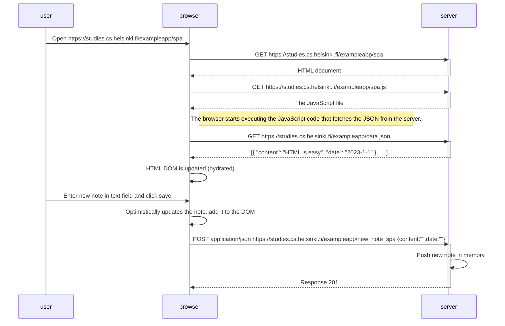

```mermaid
sequenceDiagram
participant user
participant browser
participant server

    user->>browser: Open https://studies.cs.helsinki.fi/exampleapp/spa
    browser->>server: GET https://studies.cs.helsinki.fi/exampleapp/spa
    activate server
    server-->>browser: HTML document
    deactivate server

    browser->>server: GET https://studies.cs.helsinki.fi/exampleapp/spa.js
    activate server
    server-->>browser: The JavaScript file
    deactivate server

    Note right of browser: The browser starts executing the JavaScript code that fetches the JSON from the server.

    browser->>server: GET https://studies.cs.helsinki.fi/exampleapp/data.json
    activate server
    server-->>browser: [{ "content": "HTML is easy", "date": "2023-1-1" }, ... ]
    deactivate server

    browser->>browser: HTML DOM is updated (hydrated)

    user->>browser: Enter new note in text field and click save
    browser->>browser: Optimistically updates the note, add it to the DOM
    browser->>server: POST application/json https://studies.cs.helsinki.fi/exampleapp/new_note_spa {content:"",date:""}
    activate server
    server->>server: Push new note in memory
    server-->>browser: Response 201
    deactivate server

```
